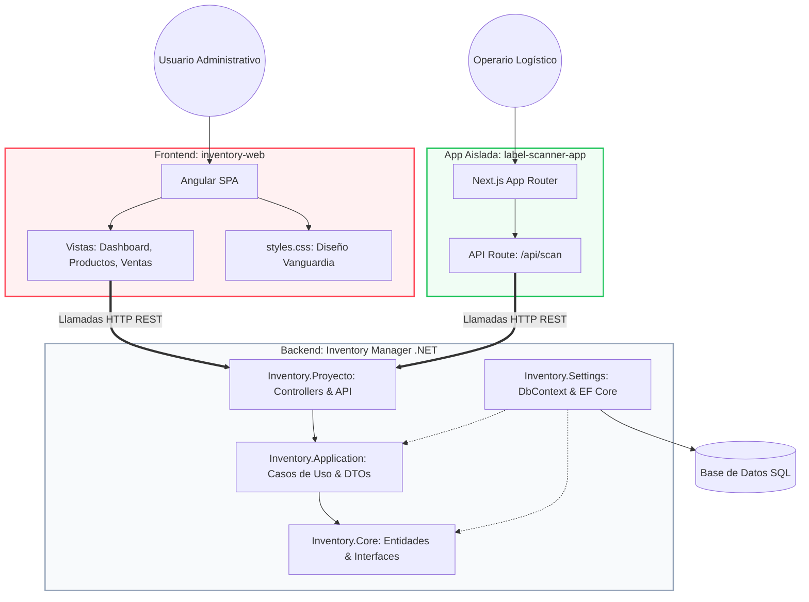

# Registro de Arquitectura y Reglas de Marca del Ecosistema SNKFVR

Este documento define la estructura de alto nivel de todo el ecosistema de la aplicación "Inventory Manager", la función principal de cada uno de sus componentes y las reglas de marca (Brand Guidelines) consolidadas.

---

## 1. Grafo de Distribución de Archivos y Arquitectura

El ecosistema está distribuido en tres grandes bloques independientes:
1. **El Backend (API Central):** Desarrollado en .NET (C#) con Arquitectura Limpia (Clean Architecture).
2. **El Frontend Administrativo:** Desarrollado en Angular (`inventory-web`).
3. **El Escáner Aislado:** Desarrollado en Next.js (`label-scanner-app`).

---

## 2. Métodos Utilizados y Función Principal

### A. Backend (`Inventory.*` en C# / .NET)
- **Función Principal:** Servir como la única fuente de la verdad para los datos financieros, transaccionales y de inventario de la aplicación.
- **Métodos y Patrones:**
  - **Clean Architecture:** Separación estricta de responsabilidades en 4 capas (API `Proyecto`, Lógica de Negocio `Application`, Dominio `Core`, Infraestructura `Settings`).
  - **Inyección de Dependencias:** Todos los servicios y repositorios están débilmente acoplados.
  - **Repository Pattern:** Abstracción del acceso a datos usando Entity Framework Core.
  - **CQRS ligero:** Separación de Casos de Uso para lecturas y escrituras dentro de `Inventory.Application/UseCases`.

### B. Frontend Administrativo (`inventory-web` en Angular)
- **Función Principal:** Panel de control de uso intensivo para los gestores del inventario. Permite consultar el estado global, registrar ventas manuales y ver análisis de rendimiento.
- **Métodos y Patrones:**
  - **Single Page Application (SPA):** Angular permite navegación instantánea sin recarga de página.
  - **Componentes Standalone:** Arquitectura modular moderna de Angular (`app.routes.ts`) cargando características perezosamente (Lazy Loading).
  - **Diseño de Vanguardia Responsivo:** UI líquida, controlada mediante variables CSS globales.

### C. Frontend de Escaneo (`label-scanner-app` en Next.js)
- **Función Principal:** Herramienta rápida de campo. Permite tomar fotos a etiquetas, usar IA Visión para extraer modelo/talla y enviarlo al backend para registro rápido.
- **Métodos y Patrones:**
  - **Server-Side Rendering (SSR) y API Routes:** Uso del App Router de Next.js para gestionar tokens y procesar peticiones seguras (`/api/scan`).
  - **React Server Components (RSC):** Optimización de carga inicial para dispositivos móviles de gama baja.

---

## 3. Contextos Delimitados (Bounded Contexts)

Para organizar las reglas de negocio, el ecosistema se divide en los siguientes contextos:

1. **Contexto de Inventario (Inventory Context):**
   - Entidades: Producto, Categoría, Estado Físico.
   - Responsabilidad: Seguimiento del ciclo de vida de los productos (Disponible, Reservado, Vendido, Entregado).
2. **Contexto de Finanzas (Financial Context):**
   - Entidades: Ventas, Gastos, Tipos de Gasto.
   - Responsabilidad: Calcular costos finales reales, márgenes de ganancia y registrar gastos adicionales de la operación.
3. **Contexto de IA y Extracción (Vision Context):**
   - Entidades: Label Data, Prompts.
   - Responsabilidad: Aislado en la app Next.js, su función es convertir datos no estructurados (imágenes) a JSON predecible.

---

## 4. Reglas de Diseño y Marca (Brand Guidelines)

La identidad de la aplicación ha sido consolidada bajo el estándar **Vanguardia 2026**. Todo nuevo desarrollo (sea web o móvil) debe apegarse estrictamente a los siguientes tokens:

- **Colores de Marca:**
  - **Fondo:** `#FFFFFF` (Blanco puro para maximizar amplitud).
  - **Acento Primario (Brand Color):** `#FF4757` (Coral-Rojo). Debe ser usado para las acciones más importantes de la aplicación (Botón "Registrar", Navegación Activa).
  - **Texto Principal:** `#1e293b` (Slate-800).
  
- **Geometría ("Liquid Depth"):**
  - **Bordes:** `20px` absoluto en todas las tarjetas (`card`), botones e inputs para asegurar una interfaz ultra-suave.
  - **Superficies:** Tarjetas limpias con bordes delgados `#f1f5f9` o elevadas con sombras amplias y teñidas del color primario (ej. `box-shadow: 0 10px 30px rgba(255, 71, 87, 0.3)`).

- **Tipografía:**
  - **Familia:** `Inter` (Google Fonts). No se admiten fuentes de sistema por defecto.
  - **Peso:** Uso agresivo del peso Extra Bold (`font-weight: 800`) para títulos de tarjetas y encabezados, contrastando fuertemente con texto secundario ligero.

- **Reglas Técnicas de CSS (Prevención de Bugs Visuales):**
  - Al hacer "Overrides" sobre componentes complejos (como PrimeNG o librerías externas), **siempre** deben forzarse en par el fondo (`background-color`) y la fuente (`color`). Si se fuerza un fondo claro (`#f8fafc`) pero el sistema o librería base usa "Modo Oscuro", resultará en texto invisible (blanco sobre blanco).
  - Nunca sobrescribir propiedades genéricas como `padding` sin usar selectores específicos de profundidad, para no romper elementos anidados (como iconos integrados en inputs).
